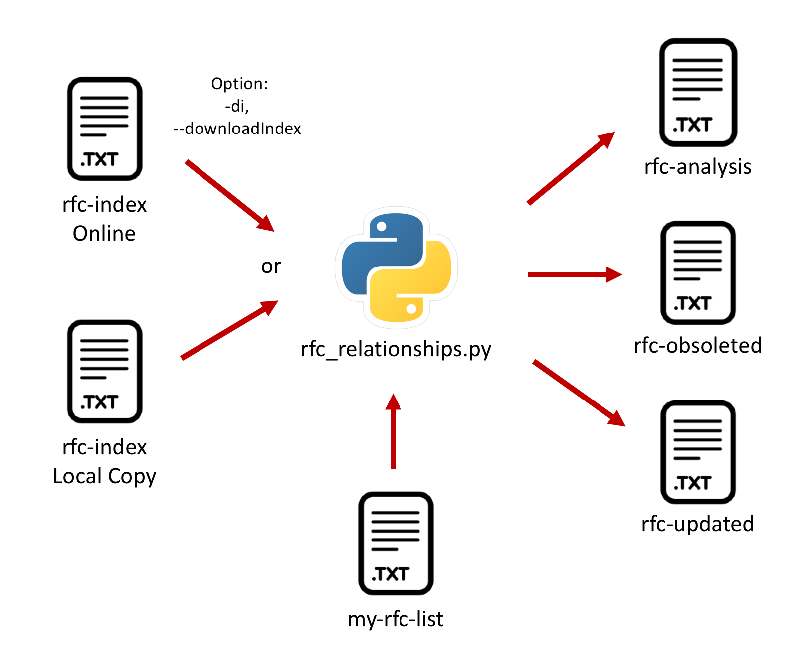

# RFC Relationships

In some cases you want to check the status of a list of IETF RFCs:

- Preparation of a Request for Quotation (RfQ).
- Analysis of a Product Datasheet.
- Verification of the Requirements for IPv6 in ICT Equipment.
  -  http://www.ripe.net/publications/docs/ripe-772
  -  http://www.ipv6.unam.mx/documentos/Recomendaciones_Licitaciones-Compras-equipos-para-IPv6-UNAM-v7.pdf

This script is provided as is to help with the those checks.

From **RFC 7841**:

   "[<RFC relation>:<RFC number[s]>]  Some relations between RFCs in the
      series are explicitly noted in the RFC header.  For example, a new
      RFC may update one or more earlier RFCs.  Currently two
      relationships are defined: "Updates" and "Obsoletes" [RFC7322].
      Variants like "Obsoleted by" are also used (e.g, in [RFC5143]).
      Other types of relationships may be defined by the RFC Editor and
      may appear in future RFCs."
  
  
# Usage
  
### python3 rfc_relationships.py [-di] [-h] [-v]

### – optional arguments:
    -di, --downloadIndex  Download current official RFC Index from
                          "http://www.ietf.org/download/rfc-index.txt",
                          if this option is not included, then it uses a
                          local RFC index downloaded previously.
    -h, --help            Show this help message and exit.
    -v, --version         Show program's version number and exit.

### Input:  One file "my-rfc-list.txt" with the list of RFCs you want to verify.

    IMPORTANT: The RFCs in the list must me specified as 'RFC8200', 'RFC 8200' or '8200'.
    And they could be separated with new line (\n) or comma (,).
    Do not add the title of the RFCs.
    See the example directory.

  
### Output: Three files:
    1. "rfc-analysis.txt"  with analysis of all RFCs with their information,
        and stating if they are "Obsoleted" or "Updated".
    2. "rfc-obsoleted.txt" with the list of obsoleted RFCs.
    3. "rfc-updated.txt"   with the list of updated RFCs.

 

